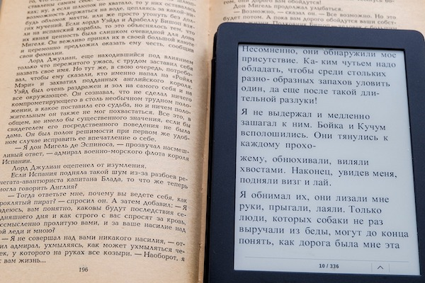

# Park_Chan_midterm
# kyuripark_winglamstephaniechan_midterm
# Midterm

 
## E-book and Traditional Book debate

We are going to argue about wheather e-books or traditional books are better

## Installation

TDDO: Describe the installation process

## Usage

TDDO: This is a page for compare the e-books or traditional books.

## Contributing

Chan Wing Lam Stephanie 

1. Fork it!
2. Create your feature branch: git checkout -b my-new-feature
3. Commit your changes: git commit -am 'Add some feature'
4. Push to the branch: git push origin my-new-feature
5. Submit a pull request :D

## credits

Chan Wing Lam Stephanie 

## Liscences
MIT

conflict is here